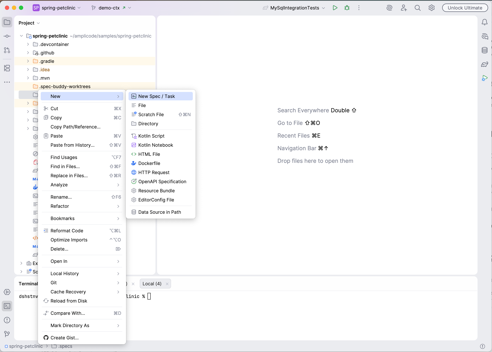
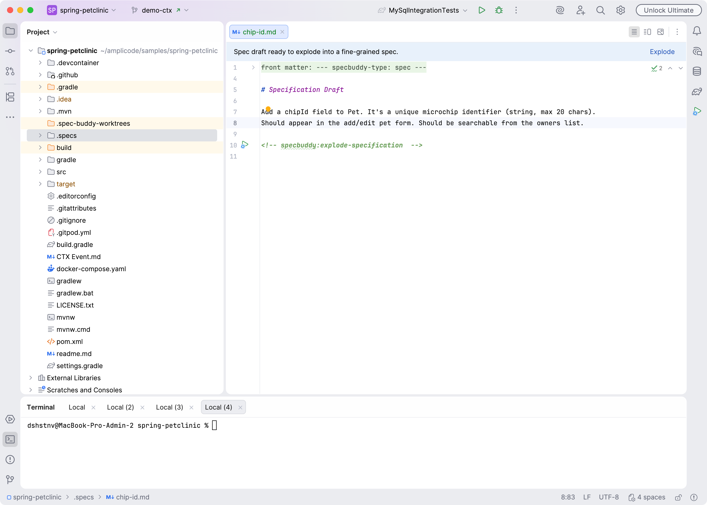
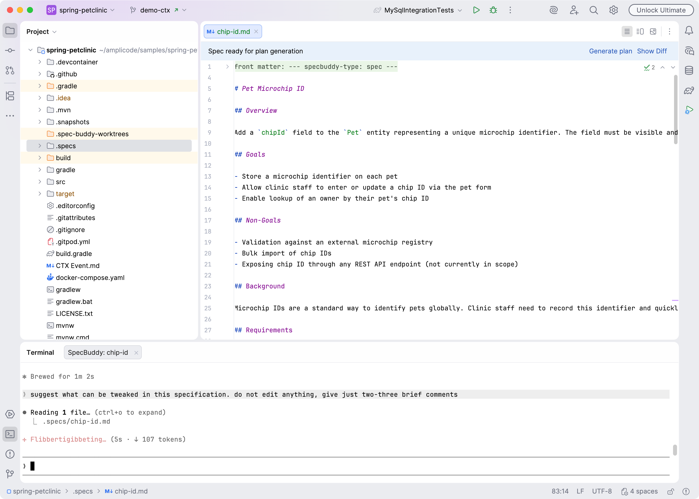
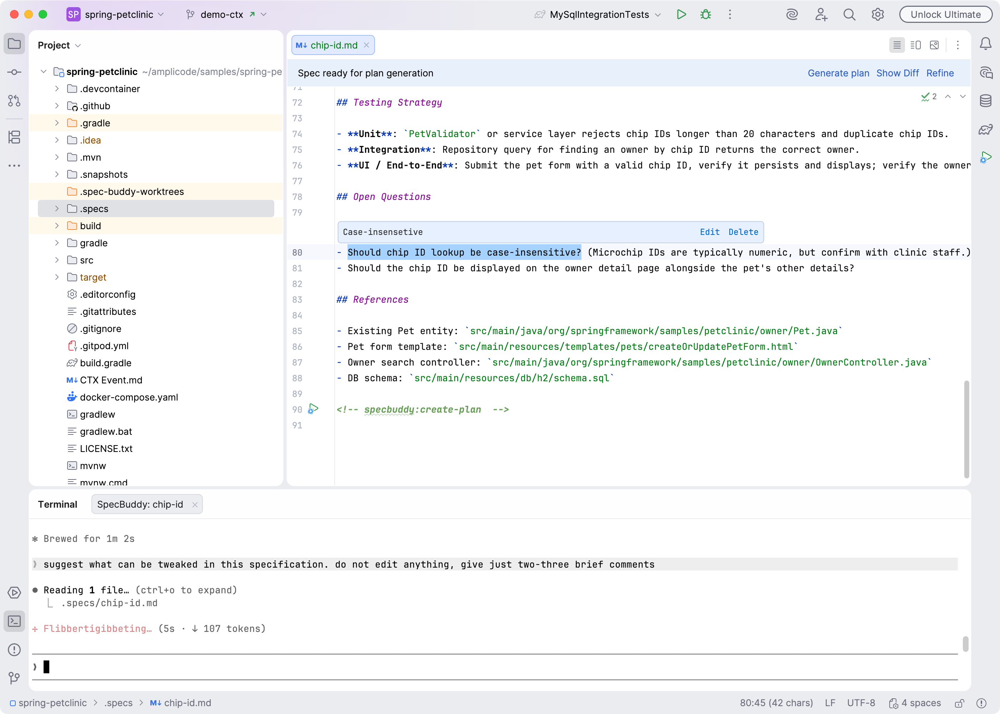
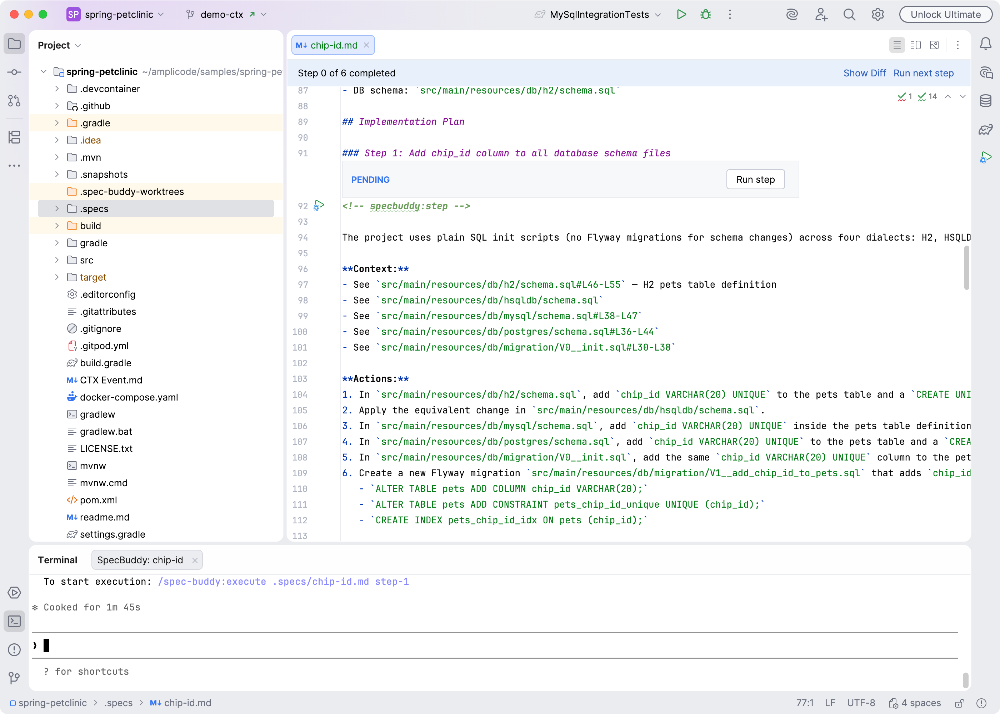
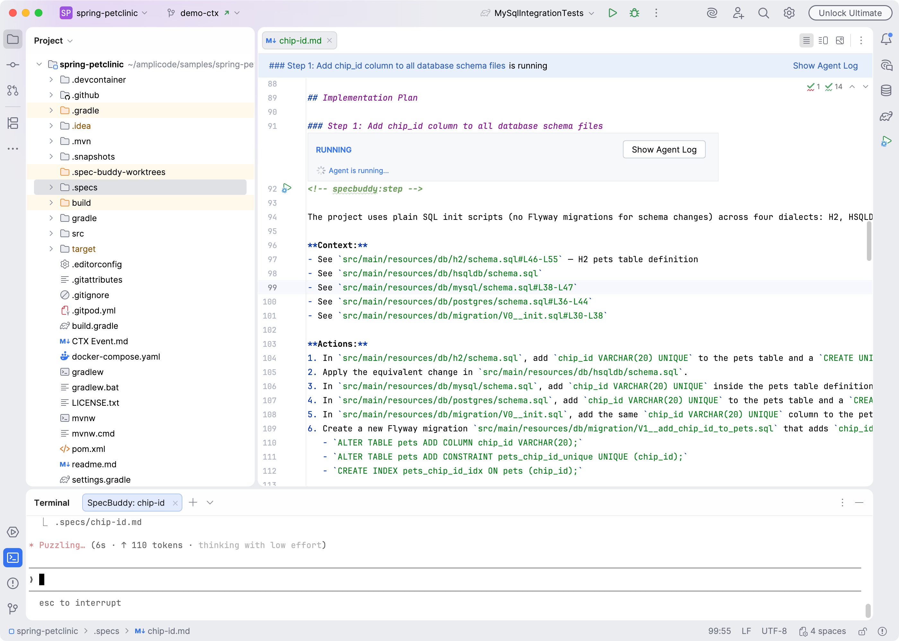
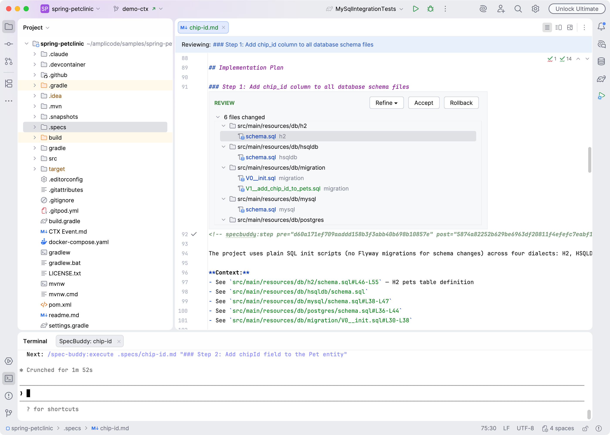
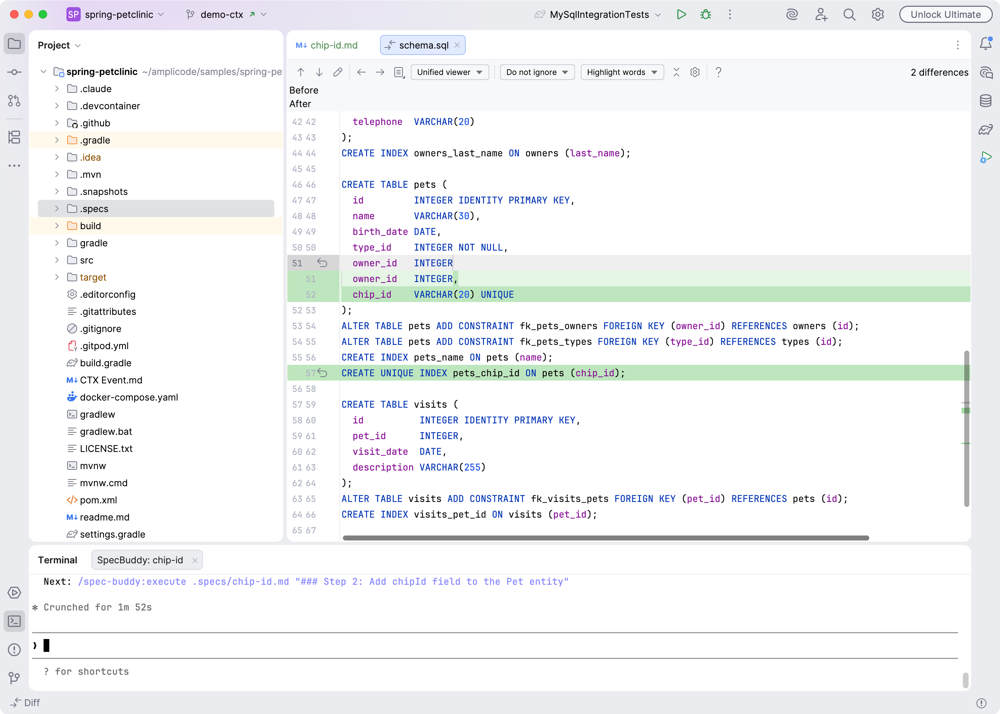
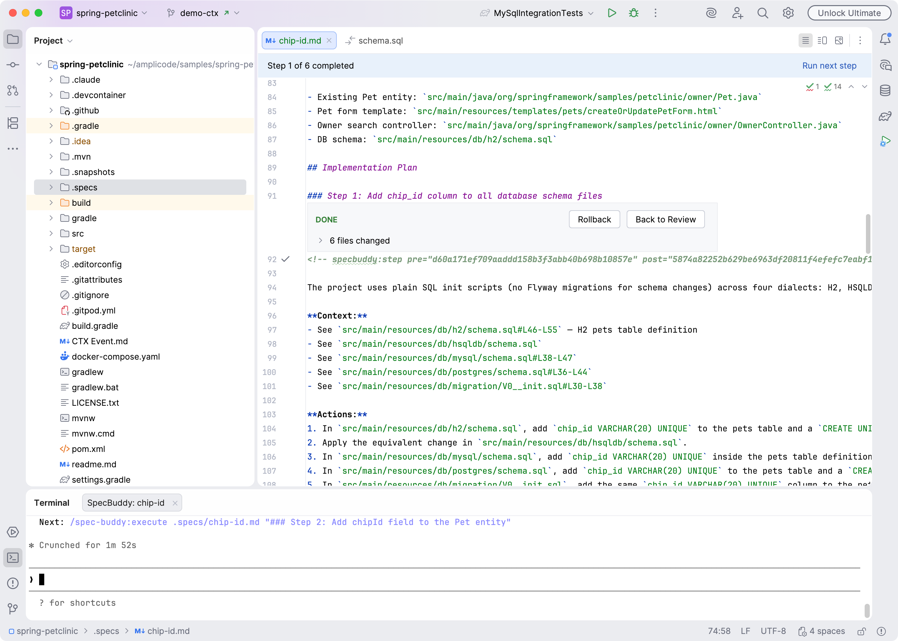

# SpecBuddy: Getting Started Guide

## What is SpecBuddy?

SpecBuddy is an IntelliJ plugin that connects your IDE to Claude Code. You write a brief description of a feature, and SpecBuddy guides you through expanding it into a full specification, generating an implementation plan, and executing that plan step by step — with a review checkpoint after every stage.

---

## Scenario: Adding `chipId` to pets in Spring PetClinic

We want to add a microchip ID field to pets: stored in the database, visible in the UI, and searchable. Let's walk through the full SpecBuddy workflow.

---

## Step 1 — Create a spec file

Open your project in IntelliJ. Right-click in the **Project** panel where you want your spec to live (e.g. `.specs/`), choose **New → New Spec / Task**, and name it `add-chip-id`.

This creates `add-chip-id.md` with a minimal template. Fill in a short draft describing what you want:

```markdown
Add a chipId field to Pet. It's a unique microchip identifier (string, max 20 chars).
Should appear in the add/edit pet form. Should be searchable from the owners list.
```

Save the file.



---

## Step 2 — Expand the draft into a full specification

Click on **Explode** link at the top of the editor or  the gutter icon next to `<!-- specbuddy:explode-specification  -->` header.

Claude Code opens in a terminal panel and reads your draft. It explores your project produces a complete specification covering functional requirements, data model changes, UI changes, and edge cases.

When Claude finishes, you would see expanded specification text.



The panel shows the spec file. Open it to read what Claude wrote. If something is wrong or missing:

- **Add an inline comment** — select the relevant text in the editor, click comment gutter icon appeared. Type your note and.
- Click **Refine** in the header. Claude re-reads the spec and your comments and rewrites accordingly.



---

## Step 3 — Generate an implementation plan

The spec file now contains the full feature description. Click the **Generate Plan** in the header.

Claude reads the specification and produces a numbered plan directly inside the spec file — a list of concrete implementation steps such as:

```
### Step 1: Add chip_id column to all database schema files
### Step 2: Add chipId field to the Pet entity
### Step 3: Add chip ID input to the pet form template
### Step 4: Validate chip ID uniqueness in PetController
### Step 5: Add chip ID search to the owner find form and controller
### Step 6: Add repository integration tests and update existing tests
```

When Claude finishes, the Review panel opens again showing the plan.



Read through the plan. If a step is missing or wrongly scoped:

- Add inline comments on specific steps.
- Click **Refine** to have Claude revise the plan.

When the plan looks correct, you can finally execute it.

---

## Step 4 — Execute steps one by one

Each plan step has a **Run** gutter icon (▶) next to its heading and an inlay with status and `Run Step` button. Click it to send that step to Claude.

Claude opens a new terminal session and implements the step — creating or modifying files in an isolated workspace so your main project is untouched while it works.

A spinner appears in the Review panel with the step name while Claude is running.



When Claude finishes, the step inlay switches to **Review** mode and lists every file it changed.



---

## Step 5 — Review the diff

Click any file in the list to open a diff view: standard Idea's diff viewer would appear, displaying changes made to the file.

You can **edit the file directly** to fix small mistakes without rejecting the whole step.

You can also add inline comments on specific changed lines to explain what needs fixing.

---

## Step 6 — Accept, Reject, or Refine

At the top of the inlay panel you have three options:

**Accept** — Claude's changes (including any edits you made) are applied to your project. The workspace is cleaned up. Move on to the next step.

**Reject** — All changes from this step are discarded. Your project is exactly as it was before. Re-run the step when you're ready.

**Refine** — Opens a split button with three choices:
- *Refine Generation* — keep the plan as-is, re-run just this step with your comments as guidance.
- *Refine Plan and Generation* — revise the plan for this step, then re-run it.
- *Reject and Refine Plan* — discard the changes and revise the plan before re-running.

---

## Step 7 — Repeat for each step

Work through the remaining steps in order. Each one is independent — you review and accept or refine before moving to the next.

After accepting the step, the inlay would display `DONE` status with ability to opening review session again or rolling back its changes.

Editor header would display overall plan progress.



---

## Tips

- You can add comments at any point — during plan review, during diff review, or both. Claude sees all of them on the next Refine run.
- If a step produces no changes (Claude found nothing to do), accepting it is instant.
- The spec file is plain Markdown and lives in your repository. You can edit it manually at any time between steps.
- If Claude's terminal session is still running and you need to see it, click **Show Agent Log** in the Review panel.
