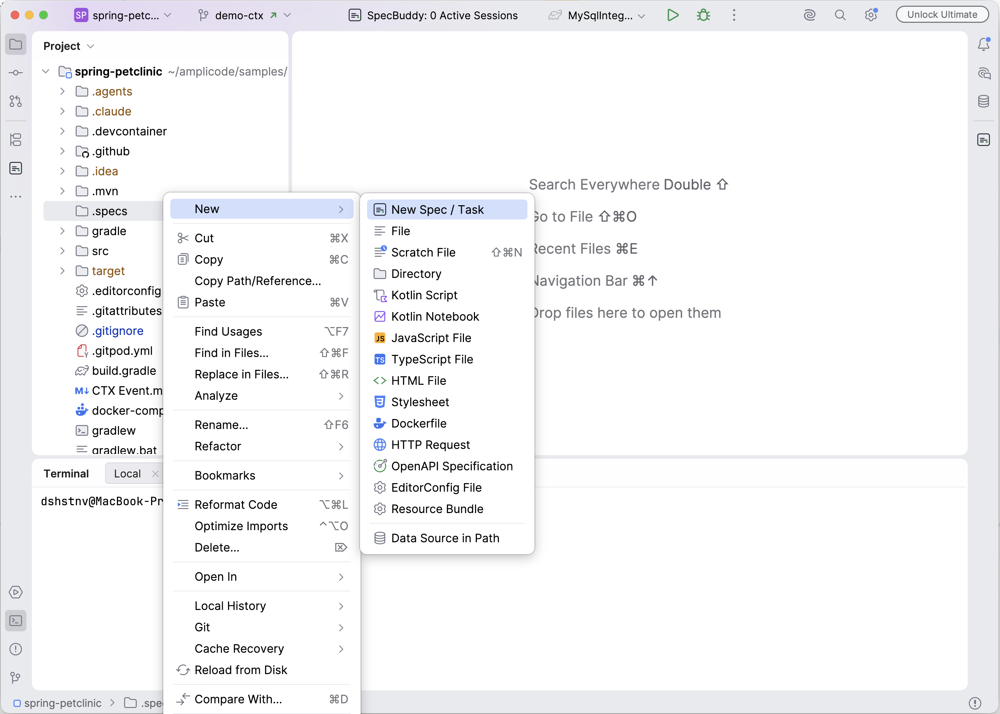
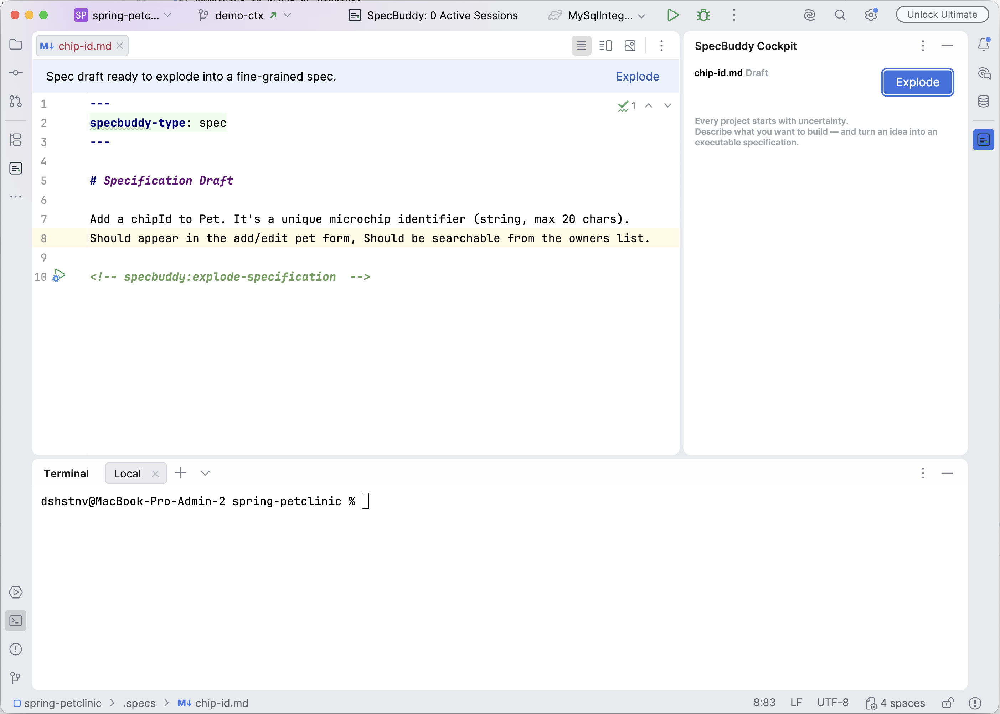
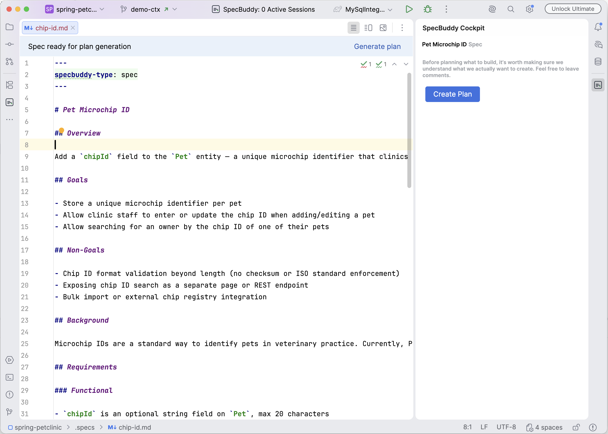
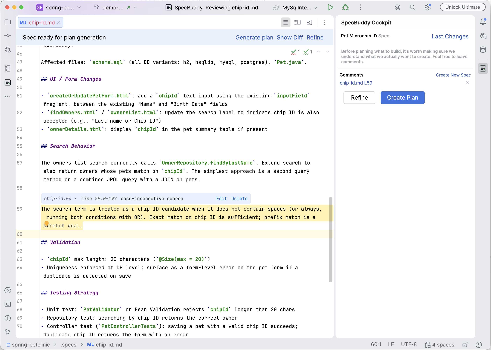
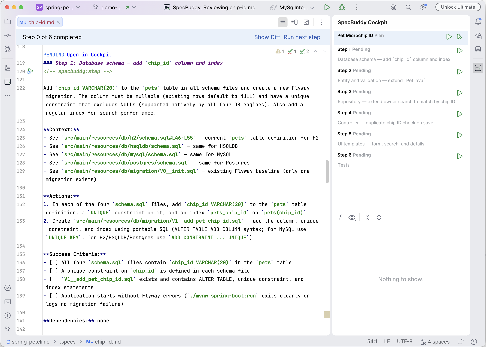
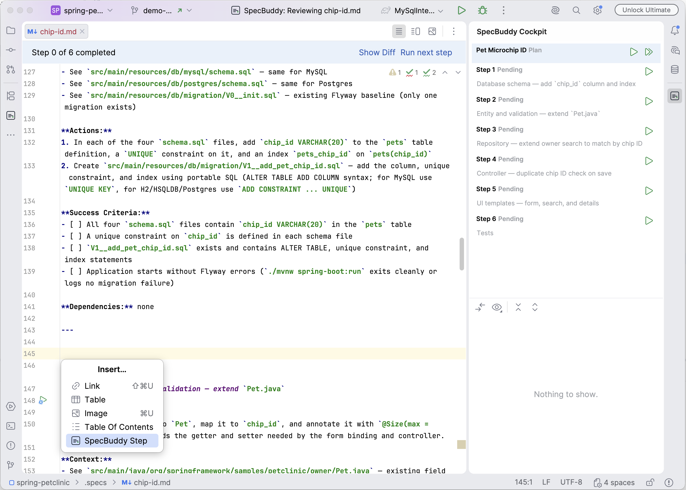
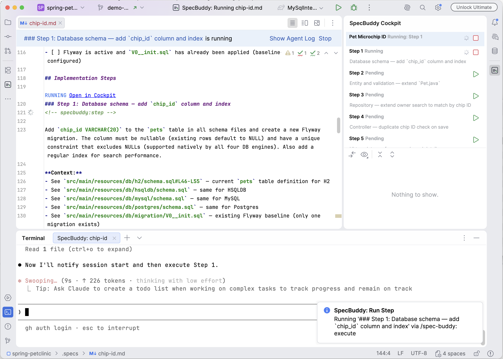
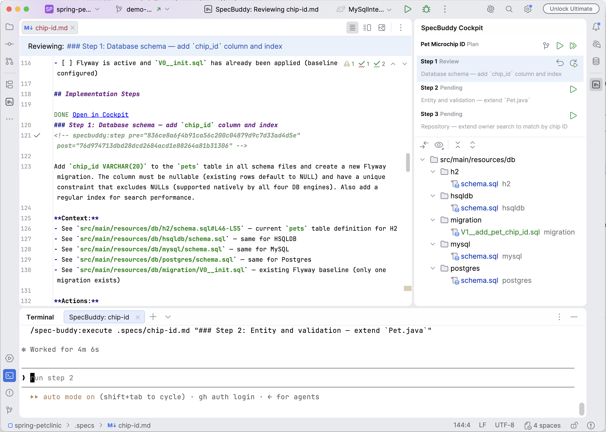

# SpecBuddy: Getting Started Guide

## What is SpecBuddy?

SpecBuddy is an IntelliJ plugin that connects your IDE to Claude Code. You write a brief description of a feature, and SpecBuddy guides you through expanding it into a full specification, generating an implementation plan, and executing that plan step by step — with a review checkpoint after every stage.

**Important: Install Claude plugin to begin working with SpecBuddy:**

```shell
curl -sSL https://raw.githubusercontent.com/SpecBuddy/spec-buddy-skill/refs/heads/main/install.sh | bash
```


---

## Scenario: Adding `chipId` to pets in Spring PetClinic

We want to add a microchip ID field to pets: stored in the database, visible in the UI, and searchable. Let's walk through the full SpecBuddy workflow.

---

## Step 1 — Create a spec file

Open your project in IntelliJ. Right-click in the **Project** panel where you want your spec to live (e.g. `.specs/`), choose **New → New Spec / Task**, and name it `add-chip-id`.



This creates `add-chip-id.md` with a minimal template. Fill in a short draft describing what you want:

```markdown
Add a chipId field to Pet. It's a unique microchip identifier (string, max 20 chars).
Should appear in the add/edit pet form. Should be searchable from the owners list.
```

Save the file.



---

## Step 2 — Expand the draft into a full specification

Click on **Explode** button in the **SpecBuddy Cockpit** toolwindow or the gutter icon next to `<!-- specbuddy:explode-specification  -->` header.

Claude Code opens in a terminal panel and reads your draft. It explores your project produces a complete specification covering functional requirements, data model changes, UI changes, and edge cases.

When Claude finishes, you would see expanded specification text.



If something is wrong or missing:

- **Add an inline comment** — select the relevant text in the editor, click comment gutter icon appeared. Type your note and.
- Click **Refine** in the header. Claude re-reads the spec and your comments and rewrites accordingly.




You can add comments anywhere in your project anytime.

---

## Step 3 — Generate an implementation plan

The spec file now contains the full feature description. Click the **Generate Plan** in the cockpit.

Claude reads the specification and produces a numbered plan directly inside the spec file — a list of concrete implementation steps.

When Claude finishes, the cockpit will display plan steps.



Read through the plan. If a step is missing or wrongly scoped:

- Add inline comments on specific steps.
- Press Cmd+N and select **SpecBuddy Step** – scaffold step would be inserted with inline comment ready.
- Click **Refine** to have Claude revise the plan.



When the plan looks correct, you can finally execute it.

---

## Step 4 — Execute steps one by one

Each plan step has a **Run** gutter icon (▶) next to its heading and an inlay with status. Click it or icon in the **Cockpit** to send that step to Claude.

Claude opens a new terminal session and implements the step — creating or modifying files in an isolated workspace so your main project is untouched while it works.

Step execution is tracked in the Cockpit panel.



When Claude finishes, the status inlay would display **Done**. Cockpit toolwindow would display a diff applied to the project. Feel free to leave a review.
If something is wrong you can **Refine** the results with your comments applied:
- *Refine Generation* — keep the plan as-is, re-run just this step with your comments as guidance.
- *Refine Plan and Generation* — revise the plan for this step, then re-run it.
- *Reject and Refine Plan* — discard the changes and revise the plan before re-running.

You can also rollback all the changes of the step.



---

## Step 5 — Repeat for each step

Work through the remaining steps in order. Each one is independent — you review and accept or refine before moving to the next. You can also launch whole plan execution – the steps would be implemented one by one. 

---

## Tips

- You can add comments at any point — during plan review, during diff review, or both. Claude sees all of them on the next Refine run.
- The spec file is plain Markdown and lives in your repository. You can edit it manually at any time between steps.
- If Claude's terminal session is still running and you need to see it, click **Show Agent Log** in the Review panel.
